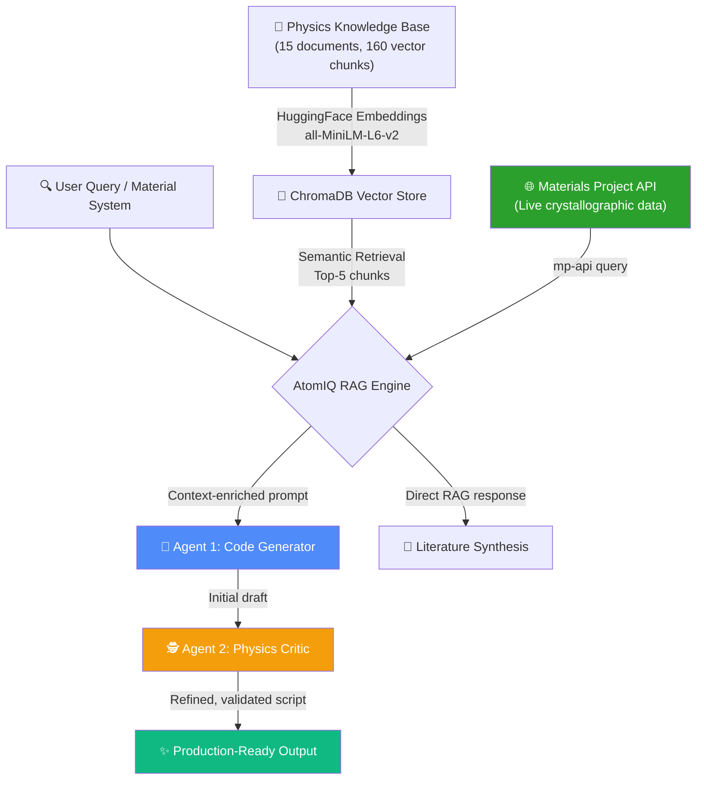

# ⚛️ AtomIQ

> **Autonomous Multi-Agent AI Framework for Computational Materials Science, DFT Simulation Automation, and Physics-Driven Code Generation**

[](https://www.python.org/)
[](https://groq.com/)
[](https://ai.google.dev/)
[](https://www.anthropic.com/)
[](https://www.trychroma.com/)
[](https://materialsproject.org/)
[](https://streamlit.io/)

Developed by **Abhijith Krishnan B M** — B.Tech-M.S. in Solid State Physics, Indian Institute of Space Science and Technology (IIST) | Former ISRO Space Applications Centre.

---

## 📸 Overview

**AtomIQ** is an autonomous AI framework that bridges solid-state physics domain expertise with modern generative AI architectures. It employs a **dual-agent system** (Code Generator + Physics Critic) augmented by a **Retrieval-Augmented Generation (RAG)** pipeline to autonomously generate, validate, and refine production-ready simulation scripts across six major domains of computational physics.

Unlike generic code generation tools, AtomIQ retrieves domain-specific knowledge from an indexed physics knowledge base and pulls **live crystallographic data** from the Materials Project API — ensuring every generated script uses physically accurate parameters (lattice constants, space groups, atomic positions, band gaps) rather than placeholder values.

### What Makes AtomIQ Different

| Feature | Generic AI Coding Tools | AtomIQ |
|---|---|---|
| **Physics grounding** | None — hallucinated parameters | RAG-augmented with indexed physics literature |
| **Materials data** | Static, often incorrect | **Live Materials Project API** — real lattice constants, band gaps |
| **Validation** | No physics validation | **Dual-agent system** — Physics Critic reviews every script |
| **Domain coverage** | General-purpose | 6 specialized physics domains, 33 script types |
| **LLM flexibility** | Single provider | **3 providers** — Groq (free), Gemini, Claude |

---

## 🏗️ Architecture



### The Dual-Agent Workflow

1. **RAG Retrieval** — The knowledge base is searched for relevant physics context (DFT parameters, material properties, simulation methodologies)
2. **Materials Project Query** — If a chemical formula is detected, AtomIQ fetches live crystallographic data (lattice parameters, space group, band gap, formation energy, atomic positions)
3. **Agent 1 (Code Generator)** — Generates a complete simulation script using the retrieved context and live materials data
4. **Agent 2 (Physics Critic)** — Reviews the script for physical inconsistencies, parameter mismatches, and computational errors, then produces the final refined code

---

## ⚡ Code Generation — 6 Domains, 33 Script Types

### 🔬 1. DFT & Electronic Structure (7 scripts)

First-principles calculations using Quantum Espresso and VASP — the workhorses of computational materials science.

| Script | Description |
|---|---|
| **Quantum Espresso — SCF Calculation** | Self-consistent field calculation with accurate pseudopotentials, k-point grids, and energy cutoffs |
| **Quantum Espresso — Band Structure** | Electronic band structure along high-symmetry paths in the Brillouin zone |
| **Quantum Espresso — DOS / PDOS** | Total and projected density of states for electronic structure analysis |
| **Quantum Espresso — Phonon Calculation (DFPT)** | Density Functional Perturbation Theory for phonon dispersion and vibrational properties |
| **Quantum Espresso — Structural Relaxation** | Geometry optimization using BFGS algorithm with variable cell relaxation |
| **VASP — INCAR/POSCAR/KPOINTS Generation** | Complete VASP input file set with appropriate ENCUT, EDIFF, ISMEAR, and k-mesh settings |
| **Python — DFT Post-Processing (pymatgen)** | Automated post-processing of DFT output files using the pymatgen library |

### 🧪 2. Molecular Dynamics (4 scripts)

Classical and ab initio molecular dynamics simulations for thermal, mechanical, and transport properties.

| Script | Description |
|---|---|
| **LAMMPS — Metal Simulation (EAM)** | Embedded Atom Method simulations for metallic systems — stress-strain, defect dynamics |
| **LAMMPS — Thermal Conductivity (Green-Kubo)** | Non-equilibrium MD for computing lattice thermal conductivity via autocorrelation functions |
| **Python — MD with ASE** | Molecular dynamics using the Atomic Simulation Environment — NVT/NPT ensembles |
| **Python — Radial Distribution Function** | Pair correlation function $g(r)$ analysis for structural characterisation |

### 📊 3. Data Analysis & Precision Metrology (6 scripts)

Signal processing, spectroscopy analysis, and precision measurement tools — informed by ISRO atomic clock metrology experience.

| Script | Description |
|---|---|
| **Python — Allan Variance / Allan Deviation** | Time-domain frequency stability analysis $\sigma_y(\tau)$ for atomic frequency standards |
| **Python — Phase Noise Analysis** | Power spectral density analysis of oscillator phase fluctuations |
| **Python — XRD Pattern Simulation** | Powder X-ray diffraction pattern generation from crystal structure data |
| **Python — Tauc Plot Band Gap Extraction** | Optical band gap determination from UV-Vis spectroscopy data using Tauc relation |
| **Python — IV Curve Analysis (Memristor)** | Current-voltage hysteresis loop analysis for resistive switching devices |
| **Python — Impedance Spectroscopy (Nyquist Plot)** | AC impedance analysis and equivalent circuit fitting for electrochemical systems |

### 💻 4. Quantum Computing (5 scripts)

Quantum circuit construction and simulation using IBM Qiskit and Google Cirq frameworks.

| Script | Description |
|---|---|
| **Qiskit — Quantum Teleportation Circuit** | Complete quantum teleportation protocol with Bell pair preparation and classical communication |
| **Qiskit — Grover's Search Algorithm** | Oracle construction and amplitude amplification for unstructured database search |
| **Qiskit — VQE (Variational Quantum Eigensolver)** | Hybrid quantum-classical ground state energy estimation with parameterized ansatz |
| **Qiskit — Bell State Preparation & Measurement** | EPR pair creation and Bell basis measurement for entanglement verification |
| **Cirq — Quantum Circuit Simulation** | Google Cirq-based circuit construction and state vector simulation |

### 🧠 5. Machine Learning for Molecules (5 scripts)

AI/ML pipelines for molecular property prediction and high-throughput screening.

| Script | Description |
|---|---|
| **Python — Molecular Graph Neural Network (MPNN)** | Graph neural network for predicting molecular properties from chemical structure |
| **Python — HOMO-LUMO Gap Prediction (Random Forest)** | Supervised ML model for electronic gap prediction from molecular features |
| **Python — Molecular Binding Energy Prediction** | Regression model for thermodynamic stability assessment |
| **Python — PubChem API Data Fetch** | Automated bulk data retrieval from the PubChem database via API |
| **Python — SMILES to RDKit Descriptor Calculation** | Molecular environment descriptor generation for ML potentials |

### 📐 6. Statistical Mechanics (5 scripts)

Computational statistical mechanics and thermodynamic simulations.

| Script | Description |
|---|---|
| **Python — 2D Ising Model (Monte Carlo)** | Metropolis Monte Carlo simulation of magnetic phase transitions on a square lattice |
| **Python — Metropolis Algorithm Simulation** | General-purpose Metropolis-Hastings sampling for thermodynamic ensembles |
| **Python — Fermi-Dirac Distribution Plotter** | Temperature-dependent Fermi-Dirac occupation function visualisation |
| **Python — Phonon Density of States** | Vibrational density of states from dynamical matrix diagonalisation |
| **Python — Boltzmann Transport Equation Solver** | Semiclassical electronic transport calculation — electrical and thermal conductivity |

---

## 🌐 Live Materials Project API Integration

When a chemical formula is detected in the user's input, AtomIQ automatically queries the Materials Project database and injects **real crystallographic data** into the code generation pipeline:

```yaml
LIVE MATERIALS PROJECT DATA for Al2O3:
  Materials Project ID: mp-1143
  Formula: Al2O3
  Crystal System: trigonal
  Space Group: R-3c
  Lattice Parameters:
    a: 4.8054 Å, b: 4.8054 Å, c: 13.1176 Å
    α: 90.00°, β: 90.00°, γ: 120.00°
  Band Gap: 5.850 eV
  Formation Energy: -3.4420 eV/atom
  Thermodynamically Stable: True
  Atomic Positions: [fractional coordinates for all sites]
```

This ensures that every Quantum Espresso or VASP input file uses **experimentally validated** lattice constants and atomic positions — not LLM-hallucinated values.

---

## 📚 Knowledge Base (15 Documents, 160 Vector Chunks)

The RAG knowledge base spans the following domains:

| Domain | Document | Topics Covered |
|---|---|---|
| **Condensed Matter** | `condensed_matter_theory.txt` | Band theory, Fermi surfaces, BCS superconductivity, Cooper pairs |
| **DFT Methods** | `dft_computational_methods.txt` | Exchange-correlation functionals, pseudopotentials, convergence testing |
| **Memristors** | `memristor_switching_mechanisms.txt` | Resistive switching, filamentary conduction, oxide barriers |
| **Memristor + Metrology** | `memristor_and_metrology_ref.txt` | ITO/Al₂O₃/Au heterostructures, tunneling transport |
| **ITO/TCO Materials** | `ito_tco_materials.txt` | Transparent conducting oxides, thin film deposition |
| **Neuromorphic Hardware** | `neuromorphic_computing_hardware.txt` | Crossbar arrays, synaptic devices, in-memory computing |
| **Atomic Clocks** | `atomic_clocks_metrology_advanced.txt` | Rubidium frequency standards, Allan deviation, clock stability |
| **Semiconductor Devices** | `semiconductor_device_physics.txt` | Fowler-Nordheim tunneling, MOS physics, band offsets |
| **Quantum Information** | `quantum_information_theory.txt` | Qubits, entanglement, Bell inequalities, quantum error correction |
| **Quantum Field Theory** | `quantum_field_theory_fundamentals.txt` | Path integrals, symmetry breaking, Higgs mechanism |
| **QFT Textbook** | Peskin & Schroeder (PDF) | Complete QFT reference — Feynman diagrams, renormalisation |
| **Statistical Mechanics** | `statistical_mechanics_thermodynamics.txt` | Partition functions, Ising model, phase transitions |
| **ML for Materials** | `machine_learning_materials_science.txt` | CGCNN, MACE, NequIP, DeePMD, ML interatomic potentials |
| **Molecular Dynamics** | `molecular_dynamics_simulations.txt` | Velocity-Verlet, thermostats, barostats, Green-Kubo |
| **Spectroscopy** | `signal_processing_spectroscopy.txt` | Tauc plots, XRD analysis, impedance spectroscopy |

---

## 🔧 Multi-Provider LLM Support

AtomIQ automatically detects and connects to the best available LLM provider:

| Provider | Model | Cost | Speed |
|---|---|---|---|
| **Groq** | Llama 3.3 70B / GPT-OSS 120B | **Free** (no API charges) | ⚡ Ultra-fast (Groq LPU) |
| **Google** | Gemini 2.0 Flash / Pro | Free tier available | Fast |
| **Anthropic** | Claude 3.5 Sonnet | Paid | Highest quality |

The system falls through providers automatically — if Groq is unavailable, it tries Gemini, then Claude. No configuration change needed.

---

## 🛠️ Quick Start

### 1. Clone & Set Up
```bash
git clone https://github.com/abhibm9602-cyber/AtomIQ.git
cd AtomIQ
python -m venv venv
source venv/bin/activate        # Linux/Mac
# venv\Scripts\activate          # Windows
pip install -r requirements.txt
```

### 2. Configure API Keys
Create a `.env` file in the project root:
```env
GROQ_API_KEY=gsk_your_groq_key_here          # Free at console.groq.com
MP_API_KEY=your_materials_project_key_here    # Free at materialsproject.org
# Optional:
GEMINI_API_KEY=your_gemini_key
ANTHROPIC_API_KEY=your_claude_key
```

### 3. Run
```bash
streamlit run app.py
```
Open `http://localhost:8501` in your browser.

---

## 📄 Repository Structure
```
AtomIQ/
├── app.py                  # Streamlit web interface with 4 tabs
├── rag_engine.py           # Core engine — RAG, dual-agent, Materials Project API
├── requirements.txt        # Python dependencies
├── Run_AtomIQ_App.bat      # Windows one-click launcher
├── data/                   # Physics knowledge base (15 documents)
│   ├── condensed_matter_theory.txt
│   ├── dft_computational_methods.txt
│   ├── memristor_switching_mechanisms.txt
│   ├── atomic_clocks_metrology_advanced.txt
│   ├── quantum_information_theory.txt
│   ├── machine_learning_materials_science.txt
│   ├── molecular_dynamics_simulations.txt
│   ├── statistical_mechanics_thermodynamics.txt
│   └── ... (15 files total)
├── chroma_db/              # Persistent ChromaDB vector store
└── README.md
```

---

## 🔬 Technical Specifications

| Component | Detail |
|---|---|
| **Embedding Model** | `sentence-transformers/all-MiniLM-L6-v2` (384-dim) |
| **Vector Store** | ChromaDB with persistent disk storage |
| **Chunk Size** | 800 characters, 200-character overlap |
| **Retrieval** | Top-5 semantic similarity search |
| **Materials API** | Materials Project v2 (`mp-api`) |
| **Frontend** | Streamlit with custom CSS theming |
| **Agent Architecture** | Dual-agent (Generator → Critic) with RAG context injection |

---

## 🤝 Author

**Abhijith Krishnan B M**  
B.Tech-M.S. in Solid State Physics | Indian Institute of Space Science and Technology (IIST)  
Former Intern, ISRO Space Applications Centre — Rubidium Atomic Clock Calibration & Precision Metrology

- [GitHub](https://github.com/abhibm9602-cyber) | [Email](mailto:abhi.bm9602@gmail.com)
