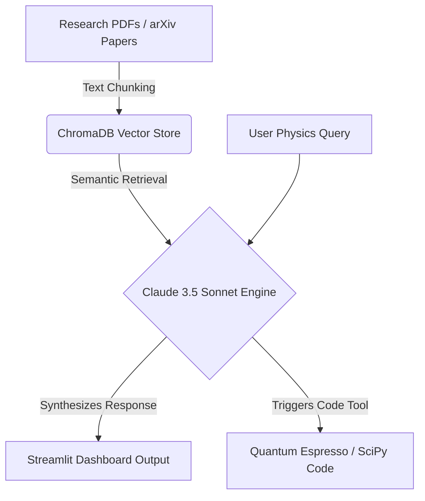

# ⚛️ PhysRAG-Materials
> **Autonomous RAG & Agentic Workflow for Solid-State Electronics, Memristive Heterostructures, & Precision Metrology**

[](https://www.python.org/)
[](https://www.anthropic.com/)
[](https://www.trychroma.com/)
[](https://streamlit.io/)

Developed by **Abhijith Krishnan B M** (B.S.-M.S. Dual Degree in Solid State Physics, IIST).

---

## 📸 Overview
`PhysRAG-Materials` bridges **solid-state physics domain expertise** with modern **Generative AI architectures**. It allows researchers to:
1. **Search & Synthesize** complex research papers on oxide heterostructures ($ITO/Al_2O_3/Au$), tunneling barriers, dynamic filamentary switching, and atomic clock frequency metrology (Allan variance, phase noise).
2. **Auto-Generate Production Code** for Density Functional Theory (DFT Quantum Espresso `.in` files) and Python time-series metrology signal analysis.

---

## 🏗️ Architecture Flow



---

## 🚀 Key Features

* **Scientific RAG Engine:** Indexes local research PDFs and notes using HuggingFace embeddings (`all-MiniLM-L6-v2`) and ChromaDB.
* **Anthropic Claude 3.5 Integration:** Performs retrieval-augmented generation grounded in physical laws and solid-state transport principles.
* **DFT Code Generator Agent:** Generates formatted SCF/NSCF Quantum Espresso input files for multilayer oxide barrier calculations.
* **Metrology Signal Tool:** Produces Python scripts for Allan deviation ($\sigma_y(\tau)$) stability analysis.

---

## 🛠️ Quick Start & Local Installation

### 1. Clone & Set Up Environment
```bash
git clone https://github.com/abhibm9602-cyber/physrag-materials.git
cd physrag-materials
python -m venv venv
source venv/bin/activate  # On Windows: venv\Scripts\activate
pip install -r requirements.txt
```

### 2. Configure API Key
Create a `.env` file in the project root:
```env
ANTHROPIC_API_KEY=your_actual_anthropic_api_key_here
```

### 3. Run the Streamlit App
```bash
streamlit run app.py
```
Open `http://localhost:8501` in your browser.

---

## 📄 Repository Structure
```
physrag-materials/
├── app.py                      # Streamlit Interactive Web Interface
├── rag_engine.py               # Core LangChain + ChromaDB + Claude RAG Engine
├── requirements.txt            # Python Dependencies
├── .env.example                # API Key Config Template
├── data/                       # Ingested Physics Papers (.txt / .pdf)
│   └── memristor_and_metrology_ref.txt
└── README.md                   # Technical Documentation
```

---

## 🤝 Author
**Abhijith Krishnan B M**  
Dual Degree in Solid State Physics | Indian Institute of Space Science and Technology (IIST)  
- [GitHub](https://github.com/abhibm9602-cyber) | [Email](mailto:abhi.bm9602@gmail.com)
